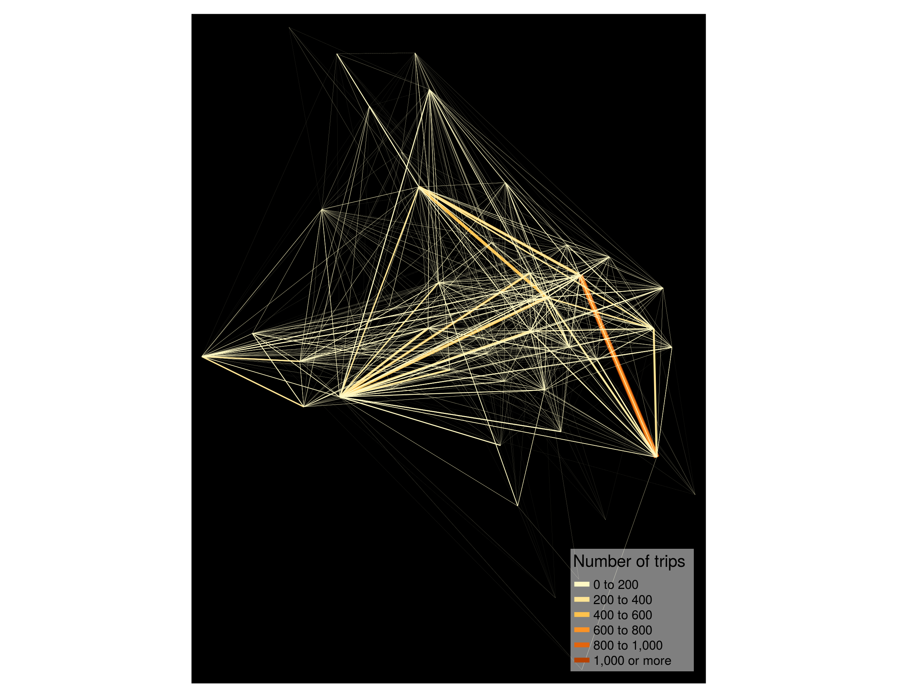
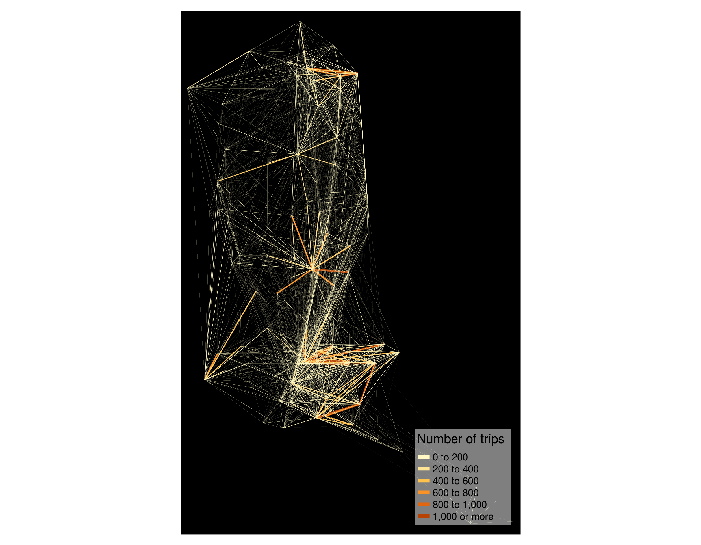
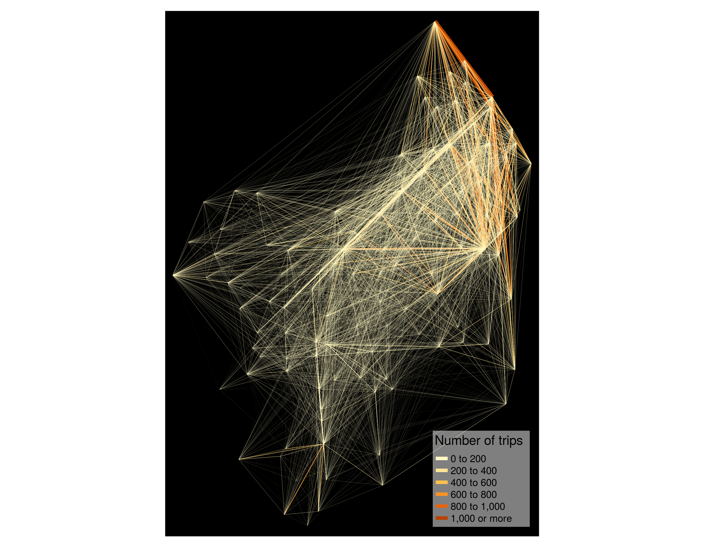

<!-- MarkdownTOC bracket="round" autolink="true" -->

- [goal](#goal)
- [method](#method)
- [outcome](#outcome)
	- [interactives](#interactives)
	- [plots](#plots)
		- [South Bay](#south-bay)
		- [East Bay](#east-bay)
		- [San Francisco](#san-francisco)

<!-- /MarkdownTOC -->

# goal

Represent origins/destination pairs in plots for bay area bikeshare trips in 2017 and 2018. 

# method

[Script](bikeshared_od_maps.R)

# outcome

## interactives

- [South Bay](https://bayareametro.github.io/Data-And-Visualization-Projects/bikeshare/interactives/south_bay_bikeshare_trips.html)
- [East Bay](https://bayareametro.github.io/Data-And-Visualization-Projects/bikeshare/interactives/east_bay_bikeshare_trips.html)
- [San Francisco](https://bayareametro.github.io/Data-And-Visualization-Projects/bikeshare/interactives/west_bay_bikeshare_trips.html)

## plots

### South Bay

. 

### East Bay

. 

### San Francisco

. 

