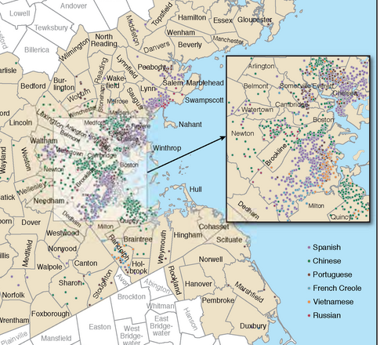

# goal:

example based on:

## draft 1

a single “dot density” map of the region’s Limited English Proficient (LEP) populations’ top 5 languages spoken at home. Spanish, Chinese, Vietnamese, Tagalog, and Korean.

## draft 2

then, other maps showing detail for each language. 
 
## data sources

The 2016 ACS data summarizing these data by tract (attached, from SI)

[data on box here](https://mtcdrive.box.com/s/obpuwuyq0en9cyd33pazaotjf6k9mv4u)

## methods

The `get_data.R` script can be used to fetch data.

## outcome 

in this directory: [language_table_2016.csv](https://github.com/BayAreaMetro/Data-And-Visualization-Projects/blob/master/census/2018_language/language_table_acs_2016.csv)