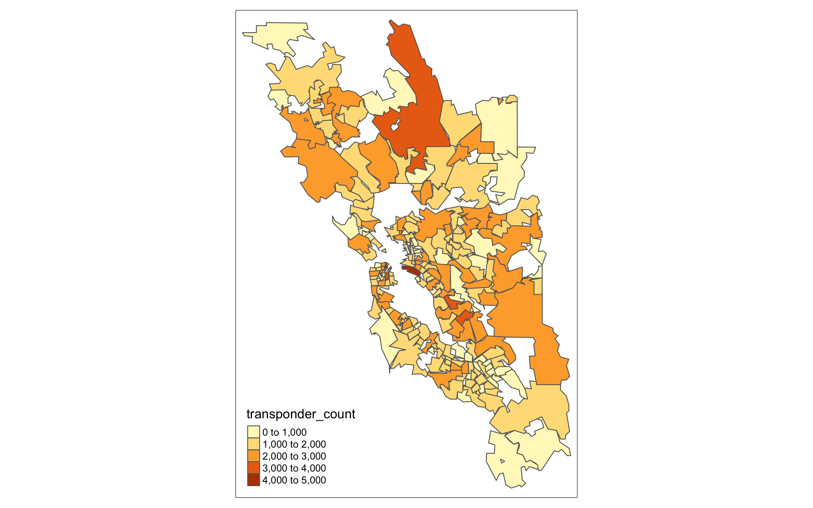

<!-- MarkdownTOC bracket="round" autolink="true" -->

- [goal:](#goal)
- [methods](#methods)
- [outcome:](#outcome)
	- [fastrak transponder counts:](#fastrak-transponder-counts)
		- [data:](#data)
		- [graphic:](#graphic)
	- [bart transfers:](#bart-transfers)
		- [data:](#data-1)

<!-- /MarkdownTOC -->

## goal:

summarise transaction data to aid in travel survey validation

## methods

- [summarise-bart-transfers.R](summarise-bart-transfers.R)
- [summarise-fastrak-ownership.R](summarise-fastrak-ownership.R)

## outcome:

### fastrak transponder counts:

#### data:

See folder [here](https://mtcdrive.box.com/s/mqo99qo8dsa5o6w7ko51snn67stlbdqp) - MTC Staff only.   

#### graphic:

The geometries have been highly simplified for viewing speed and subset to only include ZIP codes with more than 500 transponders for privacy. 

 

### bart transfers:

#### data: 

See folder [here](https://mtcdrive.box.com/s/ezfcmilu08vyur3bou3h5hd14opqwf5r) - MTC Staff only.   