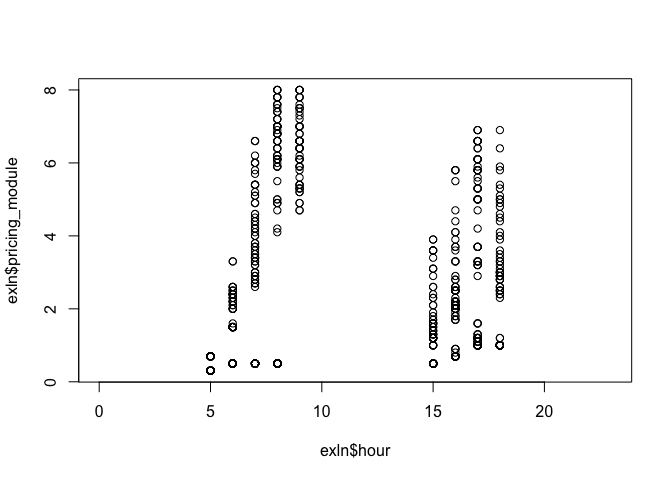

Get May 2018 VTA Expresslane data
================

-   [Goal](#goal)
-   [Methods](#methods)
-   [Outcome](#outcome)

Goal
----

Get one month's worth of this VTA toll price data (e.g. May 2018)

Methods
-------

``` r
library(clpr)
library(dplyr)
```

    ## Warning: package 'dplyr' was built under R version 3.5.1

    ## 
    ## Attaching package: 'dplyr'

    ## The following objects are masked from 'package:stats':
    ## 
    ##     filter, lag

    ## The following objects are masked from 'package:base':
    ## 
    ##     intersect, setdiff, setequal, union

``` r
library(readr)
source("~/.keys/rs.R")
rs <- connect_rs()
```

Get the data.

``` sql
SELECT pricing_module,
message_module,
convert_timezone('US/Pacific', time_checked) as time_checked,
algorithm_mode, facility_id,
interval_starting
FROM "public"."vta_expresslanes_toll_status"
where time_checked >= '05-01-2018'
and time_checked < '06-01-2018'
```

Make date and time nice to read.

``` r
library(lubridate)
```

    ## 
    ## Attaching package: 'lubridate'

    ## The following object is masked from 'package:base':
    ## 
    ##     date

``` r
exln$hour <- hour(exln$time_checked)
exln$minute <- minute(exln$time_checked)
exln$mday <- mday(exln$time_checked)
exln$wday <- wday(exln$time_checked)
knitr::kable(sample_n(exln,20))
```

|      | pricing\_module | message\_module | time\_checked       | algorithm\_mode | facility\_id |  interval\_starting|  hour|  minute|  mday|  wday|
|------|:----------------|:----------------|:--------------------|:----------------|:-------------|-------------------:|-----:|-------:|-----:|-----:|
| 3779 |                 | OPEN TO ALL     | 2018-05-07 10:47:53 |                 | CLW          |          1525715100|    10|      47|     7|     2|
| 2297 | 0.70            | HOV 2+ NO TOLL  | 2018-05-03 05:37:52 | EL Speed        | CLW          |          1525350900|     5|      37|     3|     5|
| 1588 |                 | OPEN TO ALL     | 2018-05-03 19:02:53 |                 | FSE          |          1525399200|    19|       2|     3|     5|
| 1504 |                 | OPEN TO ALL     | 2018-05-06 20:07:53 |                 | FSE          |          1525662300|    20|       7|     6|     1|
| 1073 | 0.50            | HOV 2+ NO TOLL  | 2018-05-02 07:12:53 | EL Speed        | FSE          |          1525270200|     7|      12|     2|     4|
| 3814 |                 | OPEN TO ALL     | 2018-05-07 00:12:53 |                 | CLW          |          1525677000|     0|      12|     7|     2|
| 699  |                 | OPEN TO ALL     | 2018-05-03 04:27:53 |                 | CLW          |          1525346700|     4|      27|     3|     5|
| 2177 |                 | OPEN TO ALL     | 2018-05-04 12:22:53 |                 | CLW          |          1525461600|    12|      22|     4|     6|
| 252  |                 | OPEN TO ALL     | 2018-05-02 02:22:52 |                 | CLW          |          1525252800|     2|      22|     2|     4|
| 1679 |                 | OPEN TO ALL     | 2018-05-02 10:07:53 |                 | CLW          |          1525280700|    10|       7|     2|     4|
| 1957 |                 | OPEN TO ALL     | 2018-05-04 01:52:53 |                 | CLW          |          1525423800|     1|      52|     4|     6|
| 556  |                 | OPEN TO ALL     | 2018-05-01 20:17:52 |                 | FSE          |          1525230900|    20|      17|     1|     3|
| 2553 |                 | OPEN TO ALL     | 2018-05-04 11:12:52 |                 | CLW          |          1525457400|    11|      12|     4|     6|
| 3006 |                 | OPEN TO ALL     | 2018-05-05 17:52:53 |                 | CLW          |          1525567800|    17|      52|     5|     7|
| 1759 |                 | OPEN TO ALL     | 2018-05-03 04:07:53 |                 | FSE          |          1525345500|     4|       7|     3|     5|
| 792  | 2.10            | HOV 2+ NO TOLL  | 2018-05-04 06:57:53 | EL Speed        | CLW          |          1525442100|     6|      57|     4|     6|
| 1465 |                 | OPEN TO ALL     | 2018-05-06 11:37:53 |                 | FSE          |          1525631700|    11|      37|     6|     1|
| 1765 |                 | OPEN TO ALL     | 2018-05-03 00:12:52 |                 | FSE          |          1525331400|     0|      12|     3|     5|
| 2288 |                 | OPEN TO ALL     | 2018-05-05 15:22:53 |                 | FSE          |          1525558800|    15|      22|     5|     7|
| 3129 | 0.50            | HOV 2+ NO TOLL  | 2018-05-04 08:37:53 | EL Speed        | FSE          |          1525448100|     8|      37|     4|     6|

Heads up check on time/pricing.

``` r
plot(exln$hour,exln$pricing_module)
```



``` r
write_csv(exln,"may_2018_vta_expresslane_status.csv")
```

Outcome
-------

[may\_2018\_vta\_expresslane\_status.csv](may_2018_vta_expresslane_status.csv)
